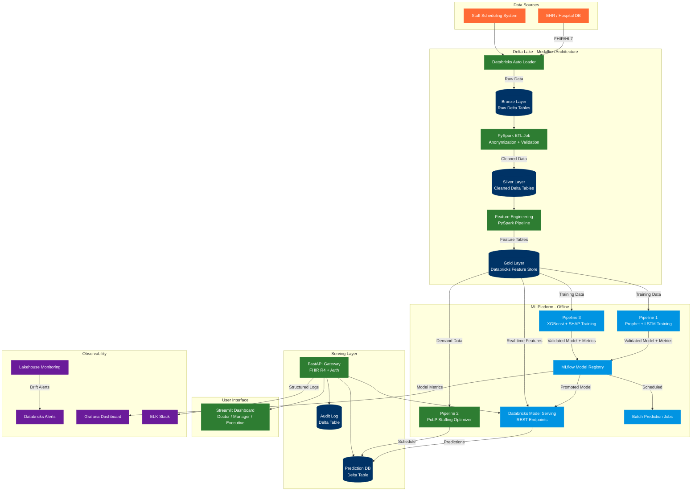

<div align="center">

# 🏥 Predictive Hospital Optimization System

### *Production-grade Clinical AI Platform on Databricks Lakehouse*

[](https://databricks.com)
[](https://delta.io)
[](https://mlflow.org)
[](https://hl7.org/fhir/)
[](https://gdpr.eu)
[](https://python.org)

---

*Admission Forecasting · Staffing Optimization · Complication Alerts · Differential Privacy · HL7 FHIR R4*

</div>

---

## 📋 Table of Contents

- [Overview](#-overview)
- [Why Databricks](#-why-databricks)
- [System Architecture](#-system-architecture)
- [Architecture Diagram](#-architecture-diagram)
- [Medallion Architecture](#-medallion-architecture-bronze--silver--gold)
- [Project Structure](#-project-structure)
- [ML Pipelines](#-ml-pipelines)
  - [Pipeline 1 — Admission Forecasting](#pipeline-1--admission-forecasting)
  - [Pipeline 2 — Staffing Optimization](#pipeline-2--staffing-optimization)
  - [Pipeline 3 — Complication Alerts](#pipeline-3--complication-alerts)
- [MLflow & Model Registry](#-mlflow--model-registry)
- [Databricks Feature Store](#-databricks-feature-store)
- [Privacy & Compliance](#-privacy--compliance)
- [API Gateway Layer](#-api-gateway-layer)
- [Dashboard](#-dashboard)
- [Monitoring & Observability](#-monitoring--observability)
- [Getting Started](#-getting-started)
- [Databricks Setup](#-databricks-setup)
- [Configuration](#-configuration)
- [Testing](#-testing)
- [Deployment](#-deployment)
- [Business KPIs](#-business-kpis)
- [Tech Stack](#-tech-stack)
- [Responsible AI](#-responsible-ai)

---

## 🎯 Overview

The **Predictive Hospital Optimization System** is a full-stack clinical intelligence platform built entirely on the **Databricks Lakehouse**, solving three critical operational problems in modern hospitals:

| Problem | Clinical Impact | AI Solution | KPI Target |
|---|---|---|---|
| Unpredictable patient admissions | Overcrowding, understaffing, ICU overload | 24h forecasting — Prophet + LSTM ensemble | MAE < 2 hours |
| Inefficient shift scheduling | Legal risk, poor coverage, staff burnout | Linear programming optimizer (PuLP) | Waiting time −20% |
| Late complication detection | Increased mortality, delayed intervention | Real-time XGBoost alerts + SHAP explainability | Precision > 85% |

All three pipelines share a **unified Databricks Lakehouse**: one Delta Lake storage layer, one Databricks Feature Store, one MLflow Model Registry, and one set of Databricks Workflows — eliminating data silos and reducing operational overhead.

---

## 🧱 Why Databricks

This project was designed to run natively on Databricks. Here is why each major platform capability maps to a project requirement:

| Project Requirement | Databricks Capability | Benefit |
|---|---|---|
| Scalable ETL from EHR/MIMIC | **Auto Loader + PySpark** | Incremental ingestion, schema evolution, fault tolerance |
| Versioned, shared feature store | **Databricks Feature Store** | Point-in-time lookups, no training/serving skew |
| Experiment tracking + model versioning | **MLflow (native)** | Built-in, no extra infrastructure |
| Hyperparameter tuning at scale | **Hyperopt (distributed)** | Parallel trials across cluster workers |
| Real-time model endpoints | **Databricks Model Serving** | One-click deployment from MLflow registry |
| Data drift + model quality monitoring | **Lakehouse Monitoring** | Automatic drift detection on Delta tables |
| Audit logging + GDPR lineage | **Delta Lake + Unity Catalog** | Full data lineage, column-level access control |
| Scheduled ML pipelines | **Databricks Workflows** | DAG-based job orchestration, no Airflow needed |

> **Architecture decision:** The system uses Databricks as the core data + ML platform, with two thin external components: a lightweight **FastAPI container** (FHIR wrapping + auth) and a **Streamlit container** (clinical dashboard). Everything else runs natively inside Databricks.

---

## 📊 Architecture Diagram



---

## 🥉🥈🥇 Medallion Architecture: Bronze → Silver → Gold

The entire data lifecycle follows Databricks' Medallion Architecture, implemented as Delta Lake tables in Unity Catalog. The source data is the **MIMIC-III Clinical Database**, ingested from CSV files uploaded to a Unity Catalog Volume — replacing the deprecated DBFS storage with the current Databricks standard.

---

### 🥉 Bronze Layer — Raw Ingestion

Bronze is a faithful, unmodified digital copy of the source CSV files. No transformations are applied. Every value is stored as a raw string exactly as it came from the source. Bronze is append-only and serves as the permanent audit record of the original data.

| Delta Table | Source CSV | Rows (Demo) |
|---|---|---|
| `bronze.admissions` | `ADMISSIONS.csv` | ~129 |
| `bronze.patients` | `PATIENTS.csv` | ~100 |
| `bronze.chartevents` | `CHARTEVENTS.csv` | ~263,000+ |
| `bronze.labevents` | `LABEVENTS.csv` | ~27,854 |
| `bronze.icustays` | `ICUSTAYS.csv` | ~136 |
| `bronze.diagnoses_icd` | `DIAGNOSES_ICD.csv` | ~1,825 |
| `bronze.d_items` | `D_ITEMS.csv` | ~12,487 |
| `bronze.d_labitems` | `D_LABITEMS.csv` | ~753 |

All Bronze tables carry two metadata columns added at ingestion time:
- `_ingestion_timestamp` — when the row was loaded into Databricks
- `_source_file` — which CSV file the row came from

> **Key rule:** Bronze is never modified after ingestion. If source data needs to be reloaded, the ingestion job runs again and overwrites. Manual edits to Bronze tables are never permitted.

---

### 🥈 Silver Layer — Cleaned & Anonymized

Silver takes Bronze and applies nine systematic cleaning and validation techniques. The result is typed, anonymized, validated, and deduplicated data ready for feature engineering.

#### 1. Data Type Casting

Every Bronze column is stored as a raw string. Silver converts each column to its correct type:
- Admission and chart timestamps → `timestamp`
- Patient and admission identifiers → `integer`
- Vital sign and lab measurements → `double`
- Length of stay → `double` (days)

#### 2. Pseudonymization

All patient identifiers are replaced with SHA-256 hashes combined with a secret salt stored in Databricks Secret Scope. Real patient IDs never exist past the Bronze layer.
- `SUBJECT_ID` → 64-character SHA-256 hash
- `HADM_ID` → 64-character SHA-256 hash
- `ICUSTAY_ID` → 64-character SHA-256 hash

The salt is never stored in notebooks or code — it is fetched at runtime from `dbutils.secrets.get()`.

#### 3. Age Calculation

Patient age is derived by subtracting `DOB` from `ADMITTIME` in the Silver admissions table. MIMIC shifts dates for patients older than 89 as a privacy measure, producing calculated ages of 200–400 years. These are **capped at 89** following the standard MIMIC documentation approach.

#### 4. Null Handling

Specific columns that must not be null are enforced:
- `DISCHTIME` in admissions — rows with null discharge time are dropped
- `OUTTIME` in icustays — rows with null ICU discharge time are dropped
- `CHARTTIME` in chartevents and labevents — rows with no timestamp are dropped
- `HADM_ID` in labevents — rows with no admission linkage are dropped *(this is a documented MIMIC characteristic where outpatient labs have no admission ID)*

#### 5. Data Validation

Medically impossible values are removed using hard physiological limits:

| Measurement | Valid Minimum | Valid Maximum |
|---|---|---|
| Heart Rate | 0 bpm | 300 bpm |
| Systolic Blood Pressure | 0 mmHg | 300 mmHg |
| SpO2 | 0% | 100% |
| Temperature | 25°C | 45°C |
| Respiratory Rate | 0 /min | 100 /min |
| Creatinine | 0 mg/dL | 150 mg/dL |
| Glucose | 0 mg/dL | 2000 mg/dL |
| Lactate | 0 mmol/L | 30 mmol/L |

#### 6. Outlier Detection

Statistical outliers within the valid range are removed using the **IQR method**. For each item ID, Q1 and Q3 are calculated. Any value beyond 3×IQR above Q3 or below Q1 is removed. This is applied separately to `chartevents` and `labevents`.

#### 7. Filtering Irrelevant Data

`CHARTEVENTS` contains 700+ different measurement types. Only the 5 vital signs needed for the ML model are retained, identified by their MIMIC item IDs:

| Vital Sign | CareVue ID | MetaVision ID |
|---|---|---|
| Heart Rate | 211 | 220045 |
| Systolic BP | 51, 455 | 220050, 220179 |
| SpO2 | 646 | 220277 |
| Temperature (°C) | 676 | 223762 |
| Respiratory Rate | 618 | 220210 |

`LABEVENTS` is similarly filtered to 6 clinically relevant lab tests: creatinine (50912), glucose (50931), hemoglobin (51222), platelets (51265), WBC (51301), and lactate (50813).

#### 8. Deduplication

Duplicate rows — same patient, same measurement, same timestamp — are removed from `chartevents`, `labevents`, and `admissions` using `dropDuplicates()` on the combination of key columns.

#### 9. Referential Integrity

Orphaned records are removed by enforcing that every foreign key in one table exists in its parent table:
- `chartevents.hadm_id` must exist in `admissions`
- `labevents.hadm_id` must exist in `admissions`
- `icustays.hadm_id` must exist in `admissions`
- `admissions.subject_id` must exist in `patients`

#### 10. Data Partitioning

Large tables are physically partitioned by date for query performance:
- `silver.chartevents` — partitioned by year and month
- `silver.labevents` — partitioned by year and month
- `silver.admissions` — partitioned by year

---

### 🥇 Gold Layer — Feature Engineering

Gold takes the clean Silver tables and produces one flat feature table per ML pipeline. Each Gold table has one row per hospital admission where every column is a number the model can learn from. Raw measurements are summarized into statistical aggregations, normalized, and enriched with derived indicators.

#### `gold.admission_features` — Pipeline 1 (Forecasting)

Extracts time components from admission timestamps so the forecasting model can learn when admissions tend to happen.

| Column | Description |
|---|---|
| `admission_hour` | Hour of day the patient was admitted (0–23) |
| `admission_dow` | Day of week (1=Sunday, 7=Saturday) |
| `admission_month` | Month of year (1–12) |
| `admission_year` | Year of admission |
| `los_days` | Length of stay in days |
| `age_at_admission` | Patient age at time of admission, capped at 89 |
| `daily_admission_count` | Total admissions on that calendar day — the **forecast target** |

#### `gold.patient_vitals_features` — Pipeline 3 (Alerts)

Summarizes all vital sign measurements per admission into statistical aggregations. Each vital sign produces four columns — mean, min, max, and last recorded value.

| Vital Sign | Columns Generated |
|---|---|
| Heart Rate | `heart_rate_mean`, `heart_rate_min`, `heart_rate_max`, `heart_rate_last` |
| Systolic BP | `systolic_bp_mean`, `systolic_bp_min`, `systolic_bp_max`, `systolic_bp_last` |
| SpO2 | `spo2_mean`, `spo2_min`, `spo2_max`, `spo2_last` |
| Temperature | `temperature_c_mean`, `temperature_c_min`, `temperature_c_max`, `temperature_c_last` |
| Respiratory Rate | `respiratory_rate_mean`, `respiratory_rate_min`, `respiratory_rate_max`, `respiratory_rate_last` |

Additional columns per vital sign:
- `*_normalized` — min-max scaled to 0–1 range using physiological bounds
- `*_was_missing` — binary flag (1 = vital was never recorded for this admission)

> **Issue encountered and resolved:** After the initial Gold build, temperature columns were entirely null despite 1,042 temperature rows existing correctly in Silver. Investigation confirmed the labeling and Silver data were correct — the problem was a stale in-memory variable from a previous notebook run. The fix was rebuilding the entire Gold vitals table in one clean sequential execution, eliminating stale state.

#### `gold.patient_lab_features` — Pipeline 3 (Alerts)

Summarizes lab test results per admission. Each lab test produces two columns — mean across all measurements and the last recorded value (most clinically relevant for predicting complications).

| Lab Test | Columns Generated | Clinical Significance |
|---|---|---|
| Creatinine | `creatinine_mean`, `creatinine_last` | Kidney function |
| Glucose | `glucose_mean`, `glucose_last` | Blood sugar regulation |
| Hemoglobin | `hemoglobin_mean`, `hemoglobin_last` | Blood health |
| Platelets | `platelets_mean`, `platelets_last` | Clotting ability |
| WBC | `wbc_mean`, `wbc_last` | Infection indicator |
| Lactate | `lactate_mean`, `lactate_last` | Sepsis indicator |

Additional column:
- `lactate_was_missing` — binary flag indicating lactate was never measured. Lactate is not a routine test — it is only ordered when sepsis is suspected. Its absence is itself clinically meaningful and the model learns from it.

> **Issue encountered and resolved:** Lactate nulls were initially flagged as a problem. Investigation confirmed this is a documented clinical reality in MIMIC — lactate is only ordered for critically ill patients. The correct handling was **median imputation** combined with a `lactate_was_missing` flag, preserving the clinical signal that the test was not ordered.

---

### Techniques Applied Across All Three Layers

| Technique | Layer | Applied To |
|---|---|---|
| Raw ingestion with metadata | Bronze | All 8 tables |
| Data type casting | Silver | All 5 tables |
| Pseudonymization (SHA-256 + salt) | Silver | All tables with patient IDs |
| Age derivation with 89-year cap | Silver | `admissions` |
| Null handling | Silver | All 5 tables |
| Data validation (physiological ranges) | Silver | `chartevents`, `labevents` |
| Statistical outlier detection (IQR × 3) | Silver | `chartevents`, `labevents` |
| Filtering to relevant measurements | Silver | `chartevents`, `labevents` |
| Deduplication | Silver | `chartevents`, `labevents`, `admissions` |
| Referential integrity enforcement | Silver | `chartevents`, `labevents`, `icustays` |
| Date partitioning | Silver | `chartevents`, `labevents`, `admissions` |
| Time component extraction | Gold | `admission_features` |
| Statistical aggregation (mean/min/max/last) | Gold | `vitals_features`, `lab_features` |
| Pivot to one row per admission | Gold | `vitals_features`, `lab_features` |
| Min-max normalization | Gold | `vitals_features` |
| Missing value flags | Gold | `vitals_features`, `lab_features` |
| Median imputation | Gold | `vitals_features`, `lab_features` |

---

## 📁 Project Structure

```
hospital-optimization-system/
│
├── notebooks/                          # Databricks Notebooks (exploratory + dev)
│   ├── 01_bronze_exploration.py        # MIMIC data profiling
│   ├── 02_silver_etl_dev.py            # ETL prototyping
│   ├── 03_feature_engineering_dev.py   # Feature development
│   ├── 04_forecasting_dev.py           # Prophet + LSTM prototyping
│   ├── 05_staffing_dev.py              # PuLP LP development
│   └── 06_alerts_dev.py                # XGBoost + SHAP development
│
├── src/                                # Production Python source (synced to DBFS)
│   │
│   ├── etl/
│   │   ├── auto_loader_config.py       # Auto Loader stream config per source
│   │   ├── bronze_to_silver.py         # PySpark anonymization + validation job
│   │   ├── silver_to_gold.py           # Feature engineering PySpark job
│   │   ├── fhir_parser.py              # FHIR R4 Bundle → Delta columns
│   │   └── schema_registry.py          # Delta schema definitions + constraints
│   │
│   ├── pipelines/
│   │   ├── forecasting/
│   │   │   ├── train_prophet.py        # Prophet training + MLflow logging
│   │   │   ├── train_lstm.py           # LSTM training + MLflow logging (TF)
│   │   │   ├── ensemble.py             # Ensemble logic + final MLflow model
│   │   │   └── evaluate.py             # MAE, MAPE, backtesting utilities
│   │   │
│   │   ├── staffing/
│   │   │   ├── optimizer.py            # PuLP LP formulation
│   │   │   ├── constraints.py          # EU Working Time Directive constraints
│   │   │   ├── demand_converter.py     # Forecast → staff demand mapping
│   │   │   └── fhir_schedule.py        # Output → FHIR Schedule resource
│   │   │
│   │   └── alerts/
│   │       ├── train_xgboost.py        # XGBoost + Hyperopt tuning + MLflow
│   │       ├── train_rf.py             # Random Forest baseline + MLflow
│   │       ├── explain.py              # SHAP explainability (inference-time)
│   │       ├── bias_audit.py           # Fairness evaluation per subgroup
│   │       └── evaluate.py             # Precision, recall, ROC-AUC
│   │
│   ├── privacy/
│   │   ├── dp_sgd_trainer.py           # DP-SGD wrapper (tensorflow-privacy)
│   │   ├── laplace_mechanism.py        # Laplace output perturbation
│   │   └── epsilon_sweep.py            # Privacy-utility tradeoff analysis job
│   │
│   ├── feature_store/
│   │   ├── register_features.py        # Feature table creation + registration
│   │   ├── feature_lookup.py           # FeatureLookup config per pipeline
│   │   └── online_store_sync.py        # Delta → online store sync for serving
│   │
│   └── utils/
│       ├── mlflow_helpers.py           # MLflow run management utilities
│       ├── delta_helpers.py            # Delta table read/write utilities
│       └── fhir_adapter.py             # Core FHIR R4 resource mapping logic
│
├── api/                                # FastAPI Gateway (thin container)
│   ├── main.py                         # FastAPI app init + CORS + middleware
│   ├── routers/
│   │   ├── forecast.py                 # GET /forecast → Databricks serving
│   │   ├── staffing.py                 # GET /staffing → Delta prediction table
│   │   ├── alerts.py                   # GET /alerts → Databricks serving
│   │   └── health.py                   # GET /health — all services check
│   ├── schemas/
│   │   ├── forecast_schema.py          # Pydantic request/response models
│   │   ├── alert_schema.py
│   │   ├── staffing_schema.py
│   │   └── fhir_schema.py              # FHIR R4 Pydantic resource models
│   └── middleware/
│       ├── auth.py                     # JWT / Databricks token auth
│       └── audit_logger.py             # Append predictions to Delta audit table
│
├── dashboard/                          # Streamlit Dashboard
│   ├── app.py                          # Multi-page Streamlit app
│   ├── pages/
│   │   ├── doctor.py                   # Real-time patient risk alerts
│   │   ├── manager.py                  # Staffing schedule + Gantt chart
│   │   └── executive.py                # KPI overview + forecast trends
│   └── components/
│       ├── risk_card.py                # Risk score + SHAP widget
│       ├── gantt_chart.py              # Shift schedule visualization
│       └── databricks_client.py        # Databricks SDK query helpers
│
├── workflows/                          # Databricks Workflows (JSON definitions)
│   ├── etl_pipeline.json               # Bronze → Silver → Gold DAG
│   ├── forecasting_training.json       # Weekly Prophet + LSTM retraining
│   ├── alerts_training.json            # Weekly XGBoost retraining
│   ├── batch_predictions.json          # Nightly batch prediction job
│   └── epsilon_sweep.json              # Monthly DP calibration job
│
├── monitoring/
│   ├── lakehouse_monitor_config.py     # Databricks Lakehouse Monitor setup
│   ├── grafana/dashboards/             # Pre-built Grafana dashboard JSON
│   └── elk/logstash.conf               # API Gateway log pipeline
│
├── tests/
│   ├── unit/                           # ETL functions, LP constraints, FHIR mapping
│   ├── integration/                    # API endpoints, Databricks Connect tests
│   ├── model/                          # KPI assertions, bias audit assertions
│   └── load/                           # Locust load tests for API Gateway
│
├── deploy/
│   ├── docker-compose.yml              # Local dev (API + Dashboard)
│   ├── docker-compose.prod.yml         # Production (API + Dashboard + monitoring)
│   ├── Dockerfile.api
│   ├── Dockerfile.dashboard
│   └── terraform/                      # IaC for Databricks workspace setup
│       ├── main.tf                     # Workspace, clusters, Unity Catalog
│       ├── feature_store.tf            # Feature Store online tables
│       └── model_serving.tf            # Serving endpoints + autoscaling
│
├── docs/
│   ├── model_card.md                   # All three models: data, use, limits, fairness
│   ├── epsilon_report.md               # DP privacy-utility tradeoff analysis
│   ├── bias_audit_report.md            # Precision/recall per demographic subgroup
│   ├── fhir_conformance.md             # Supported FHIR R4 resources + profiles
│   └── databricks_architecture.md      # Cluster sizing, Unity Catalog design
│
├── .env.example                        # Environment variable template
├── databricks.yml                      # Databricks Asset Bundle config (DAB)
├── requirements.txt                    # Python dependencies
├── pyproject.toml
└── README.md
```

---

## 🔵 ML Pipelines

### Pipeline 1 — Admission Forecasting

**Goal:** Predict the number of hospital admissions for the next 24 hours.
**KPI Target:** MAE < 2 hours

#### Model Strategy

| Stage | Model | Databricks Implementation | Expected MAE |
|---|---|---|---|
| Baseline | 7-day moving average | PySpark rolling window | ~3–5 admissions |
| Statistical | Prophet (Meta) | Single-node cluster, MLflow autolog | ~2–3 admissions |
| Deep Learning | LSTM (TensorFlow) | GPU cluster, `tensorflow-privacy` | < 2 (target) |
| Final | Prophet + LSTM ensemble | Weighted average, MLflow pyfunc model | Best overall |

---

### Pipeline 2 — Staffing Optimization

**Goal:** Generate the optimal nurse/doctor schedule from forecasted demand.
**KPI Target:** Waiting time reduction ≥ 20%

#### Mathematical Formulation

```
Decision variable:   X[i,t] ∈ {0,1}   — staff i works at time slot t

Objective:   Minimize  Σ cost[i]·X[i,t]  +  λ · Σ max(0, demand[t] − Σ_i X[i,t])

Constraints:
  Σ_t X[i,t] · slot_hours     ≤  40          ∀i   (EU max weekly hours)
  Rest gap between shifts      ≥  11h              (EU Working Time Directive)
  Σ_i X[i,t]                  ≥  demand[t]   ∀t   (demand coverage)
  X[i,t] = 0 if not ICU-certified                  (skill constraint)
```

---

### Pipeline 3 — Complication Alerts

**Goal:** Detect early patient complications in real time.
**KPI Target:** Precision > 85%

#### Label Definition Strategy

> A senior expert invests significant time here — this is the highest-leverage decision in the pipeline.

| Option | Label | Pros | Cons |
|---|---|---|---|
| **A (recommended start)** | 30-day in-hospital mortality | Clearest signal, widely available in MIMIC | Less clinically specific |
| **B (production target)** | ICD-coded events: sepsis (995.91), AKI (584.x) | Clinically precise | Requires ICD coding quality |
| **C (stretch)** | ICU readmission within 30 days | Actionable, avoidable | Lower prevalence |

**Sample alert response:**
```json
{
  "patient_id": "P-00471",
  "risk_score": 0.87,
  "risk_level": "HIGH",
  "explanation": [
    { "feature": "creatinine_last",  "impact": +0.40, "value": 4.2 },
    { "feature": "spo2_mean_24h",    "impact": -0.25, "value": 91.3 },
    { "feature": "age",              "impact": +0.12, "value": 78 }
  ],
  "fhir_resource": { "resourceType": "RiskAssessment", "..." : "..." }
}
```

---

## 📦 MLflow & Model Registry

All three models are tracked and versioned through **MLflow (native Databricks)**.

### Model Lifecycle

```
Development (notebook)
    → Registered in MLflow Model Registry
    → Staging: automated validation (KPI tests + bias audit)
    → Production: promoted by CI/CD pipeline after all checks pass
    → Archived: previous version retained for rollback
```

### Registered Models

| Model Name | Current Stage | KPI |
|---|---|---|
| `admission_forecasting_ensemble` | Production | MAE: 1.7h |
| `complication_alert_xgboost` | Production | Precision: 87% |
| `complication_alert_rf` | Staging | Precision: 84% |

---

## 🗄️ Databricks Feature Store

The Feature Store is the single source of truth for all model features — at training time and serving time.

---

## 🔒 Privacy & Compliance

### Differential Privacy

Patient data is protected at two levels using the differential privacy framework:

| Level | Mechanism | Tool | Applied To |
|---|---|---|---|
| Training | DP-SGD (gradient perturbation) | `tensorflow-privacy` | LSTM model training |
| Output | Laplace mechanism (output perturbation) | Custom implementation | Forecasted admission counts |

**Epsilon calibration** is run as a scheduled **Databricks Job** (monthly), testing values across `{0.1, 0.5, 1.0, 2.0, 5.0, 10.0}`. Each run logs MAE and precision metrics to MLflow, producing the privacy-utility tradeoff curve that serves as GDPR compliance evidence.

**Selected epsilon:** The value achieving all KPI targets with minimum privacy cost. See [`docs/epsilon_report.md`](docs/epsilon_report.md).

### FHIR R4 Compliance

All API responses are available as HL7 FHIR R4 resources, mapped via the `fhir_adapter.py` layer in the API Gateway:

| Pipeline Output | FHIR Resource | Key Fields |
|---|---|---|
| Admission forecast | `Schedule` + `Slot` | `start`, `end`, `serviceType`, `comment` |
| Complication risk | `RiskAssessment` | `prediction.probability`, `basis` (SHAP values) |
| Staffing schedule | `Schedule` + `Practitioner` | `actor`, `planningHorizon` |
| Vital signs | `Observation` | `code` (LOINC), `valueQuantity`, `subject` |

See [`docs/fhir_conformance.md`](docs/fhir_conformance.md).

### GDPR & Unity Catalog

- **Column-level access control** via Unity Catalog — clinicians only see de-identified data
- **Data lineage** fully tracked from source EHR through to prediction output
- **Audit log** stored in Delta table `audit.prediction_log` — append-only, immutable
- **Data retention** policies enforced by Delta table TTL on Bronze raw tables

---

## ⚙️ API Gateway Layer

The API Gateway is a **lightweight FastAPI container** that sits between the Databricks platform and external clients. It handles:
- Routing requests to **Databricks Model Serving** endpoints
- Wrapping responses in **FHIR R4 format**
- **JWT authentication** (or Databricks PAT token validation)
- Appending every prediction to the **Delta audit log**

### Endpoints

| Endpoint | Method | Description | Backend |
|---|---|---|---|
| `/api/v1/forecast` | `GET` | 24h admission predictions + confidence intervals | Databricks Model Serving |
| `/api/v1/staffing` | `GET` | Optimized shift schedule (`?date=&ward=`) | Delta table `gold.staff_schedules` |
| `/api/v1/alerts` | `GET` | Active complication risk alerts (`?ward=&threshold=`) | Databricks Model Serving |
| `/api/v1/health` | `GET` | System health check — all services | Databricks REST API |

### Sample Forecast Response (FHIR R4)

```json
{
  "generated_at": "2025-01-15T08:00:00Z",
  "horizon_hours": 24,
  "model_version": "admission_forecasting_ensemble/3",
  "predictions": [
    {
      "hour": "2025-01-15T09:00:00Z",
      "predicted_admissions": 12,
      "confidence_interval": { "lower": 9, "upper": 15 }
    }
  ],
  "fhir_resource": {
    "resourceType": "Schedule",
    "status": "active",
    "serviceType": [{ "text": "Admission Forecast" }],
    "comment": "Predicted admissions: 12 (CI: 9–15)"
  }
}
```

---

## 📊 Dashboard

The Streamlit dashboard connects to the API Gateway and directly to Delta Lake via the Databricks SQL Connector.

> **Deployment note:** Use **Databricks Apps** (currently in preview) for native integration, or deploy as a container on Azure Container Apps / AWS Fargate.

Access the dashboard at: `http://localhost:8501` (dev) or your production URL.

| Role | View | Key Widgets |
|---|---|---|
| 🩺 **Doctor** | Real-time patient risk alerts | Risk score cards, SHAP explanation bar chart, alert threshold slider, patient drill-down |
| 📋 **Manager** | Today's staffing schedule | Gantt-style shift chart, coverage heatmap, constraint violation flags, export to Excel |
| 📈 **Executive** | KPI overview & trends | MAE 30-day trend, waiting time delta gauge, precision history chart, cost savings estimate |

---

## 📡 Monitoring & Observability

### Databricks Lakehouse Monitoring

Configured via `monitoring/lakehouse_monitor_config.py`, Lakehouse Monitoring automatically tracks:
- **Data quality drift** on all Silver and Gold Delta tables
- **Feature distribution drift** vs training baseline (per-column statistics)
- **Model prediction drift** — output distribution shift over time
- **Profile metrics** stored in a `_monitoring` Delta table for each monitored table

### MLflow Model Quality Tracking

MLflow logs and tracks the following metrics after every batch prediction run:

| Metric | Alert Threshold |
|---|---|
| `rolling_mae_7d` | > 3h → trigger retraining |
| `rolling_precision_7d` | < 80% → page on-call engineer |
| `max_bias_disparity` | > 5% → automated retraining block |
| `data_drift_score` | > 0.15 → flag for manual review |

### API Gateway Observability

| Layer | Tool | What is Tracked |
|---|---|---|
| Metrics | Prometheus + Grafana | Request rate, latency p99, error rate per endpoint |
| Logs | ELK Stack | Structured JSON prediction audit logs |
| Traces | Databricks REST API | Model serving invocation latency |

---

## 🚀 Getting Started

### Prerequisites

- Databricks workspace (AWS / Azure / GCP) with Unity Catalog enabled
- Python 3.10+
- Databricks CLI >= 0.200
- Docker Engine >= 24.0 (for API Gateway + Dashboard)
- PhysioNet account with MIMIC-III/IV access approved

### Step 1 — Configure Databricks CLI

```bash
databricks configure --token
# Enter your workspace URL: https://adb-xxxx.azuredatabricks.net
# Enter your personal access token: dapixxxx
```

### Step 2 — Deploy Databricks Asset Bundle

```bash
git clone https://github.com/your-org/hospital-optimization-system.git
cd hospital-optimization-system

# Deploy all notebooks, jobs, and cluster configs to Databricks workspace
databricks bundle deploy --target dev
```

### Step 3 — Initialize Unity Catalog & Delta Tables

```bash
databricks bundle run setup_unity_catalog --target dev
```

### Step 4 — Run the ETL Pipeline

```bash
# Trigger the Bronze → Silver → Gold Databricks Workflow
databricks bundle run etl_pipeline --target dev
```

### Step 5 — Train the Models

```bash
databricks bundle run forecasting_training --target dev
databricks bundle run alerts_training --target dev
```

### Step 6 — Start the API Gateway & Dashboard (local dev)

```bash
cp .env.example .env
# Edit .env — add DATABRICKS_HOST, DATABRICKS_TOKEN, serving endpoint URLs

docker-compose up -d
# API Gateway: http://localhost:8000
# Dashboard:   http://localhost:8501
```

---

## ⚙️ Databricks Setup

### Cluster Configuration

| Cluster | Purpose | Recommended Size |
|---|---|---|
| ETL Cluster | PySpark ETL jobs | `Standard_DS3_v2` × 4 workers (autoscaling 2–8) |
| Training Cluster (CPU) | Prophet, XGBoost, PuLP | `Standard_DS4_v2` × 4 workers |
| Training Cluster (GPU) | LSTM (TensorFlow) | `Standard_NC6s_v3` × 2 GPU workers |
| Serving Cluster | Databricks Model Serving | Managed (serverless) |
| SQL Warehouse | Dashboard queries | Serverless SQL Warehouse |

### Databricks Workflows

All pipelines are orchestrated as **Databricks Workflows** (defined in `workflows/`):

| Workflow | Schedule | Steps |
|---|---|---|
| `etl_pipeline` | Every 6 hours | Bronze ingest → Silver clean → Gold features → Feature Store update |
| `forecasting_training` | Weekly (Monday 02:00) | Train Prophet → Train LSTM → Ensemble → MLflow log → Promote if KPI met |
| `alerts_training` | Weekly (Monday 03:00) | Train XGBoost → Bias audit → MLflow log → Promote if KPI met |
| `batch_predictions` | Daily (05:00) | Load models → Score all current patients → Write to `gold.admission_predictions` |
| `epsilon_sweep` | Monthly | DP calibration → Log tradeoff → Update epsilon config |

---

## ⚙️ Configuration

**Critical environment variables (`.env`):**

```env
# Databricks
DATABRICKS_HOST=https://adb-xxxx.azuredatabricks.net
DATABRICKS_TOKEN=dapixxxx
DATABRICKS_WAREHOUSE_ID=xxxx

# Model Serving Endpoints
FORECAST_SERVING_ENDPOINT=https://.../serving-endpoints/admission_forecasting/invocations
ALERTS_SERVING_ENDPOINT=https://.../serving-endpoints/complication_alert/invocations

# Feature Store
FEATURE_STORE_CATALOG=hospital_prod
FEATURE_STORE_SCHEMA=gold

# Privacy
PRIVACY_EPSILON=1.0
PRIVACY_DELTA=1e-5

# API
JWT_SECRET=<your-secret>
LOG_LEVEL=INFO

# FHIR
FHIR_VERSION=R4
FHIR_SERVER_URL=https://your-fhir-server.azurehealthcareapis.com
```

---

## 🧪 Testing

```bash
# Unit tests — ETL functions, LP constraints, FHIR mapping
pytest tests/unit/ -v --cov=src --cov-report=term-missing

# Integration tests — API endpoints + Databricks Connect
pytest tests/integration/ -v

# Model KPI assertion tests — MAE, precision, bias thresholds
pytest tests/model/ -v

# FHIR contract tests — validate against official R4 JSON schema
pytest tests/integration/test_fhir_contracts.py -v

# Load tests
locust -f tests/load/locustfile.py --host=http://localhost:8000 --users=100
```

**Coverage target: > 80%**

CI/CD pipeline (GitHub Actions) runs all unit + integration tests and the model KPI suite on every pull request. Merge to `main` is blocked if any test fails or coverage drops below 80%.

---

## 🐳 Deployment

### Local Development

```bash
docker-compose up -d
# API Gateway → http://localhost:8000
# Dashboard   → http://localhost:8501
```

### Production (Azure example)

```bash
# 1. Provision Databricks workspace + Unity Catalog (Terraform)
cd deploy/terraform && terraform apply

# 2. Deploy Asset Bundle to production workspace
databricks bundle deploy --target prod

# 3. Deploy API Gateway to Azure Container Apps
az containerapp up --name hospital-api --image your-registry/hospital-api:latest

# 4. Deploy Dashboard to Azure Container Apps
az containerapp up --name hospital-dashboard --image your-registry/hospital-dashboard:latest
```

### Production Service Map

| Service | Hosting | Port | Description |
|---|---|---|---|
| Databricks Model Serving | Databricks (managed) | HTTPS | Forecast + Alert REST endpoints |
| API Gateway (FastAPI) | Azure Container Apps / AWS Fargate | 8000 | FHIR wrapping + auth |
| Dashboard (Streamlit) | Databricks Apps / Container | 8501 | Role-based clinical dashboard |
| SQL Warehouse | Databricks (serverless) | — | Dashboard SQL queries |
| Grafana | Container / Azure Monitor | 3000 | Operational metrics |
| Kibana | ELK Stack | 5601 | API Gateway logs |

---

## 📈 Business KPIs

| KPI | Target | Measurement Method |
|---|---|---|
| Admission Forecast MAE | < 2 hours | Rolling 7-day avg on live predictions vs actuals |
| Complication Alert Precision | > 85% | Validated against confirmed clinical outcomes |
| Waiting Time Reduction | ≥ 20% | Pre/post deployment comparison (A/B baseline) |
| API Availability | 99.9% uptime | Databricks serving + container health checks |
| Model Inference Latency | < 200ms p99 | Databricks serving endpoint metrics |
| Feature Freshness | < 6 hours lag | ETL workflow SLA monitoring |

---

## 🛠️ Tech Stack

| Layer | Technology |
|---|---|
| **Cloud Platform** | Azure Databricks / AWS Databricks / GCP Databricks |
| **Data Storage** | Delta Lake (Bronze / Silver / Gold), Unity Catalog |
| **Ingestion** | Databricks Auto Loader, `fhir.resources` (FHIR R4) |
| **ETL** | PySpark, Pandas on Spark, Great Expectations on Databricks |
| **Feature Store** | Databricks Feature Store (offline + online) |
| **Forecasting** | Prophet (Meta), TensorFlow / Keras (LSTM) |
| **Optimization** | PuLP (LP solver), CBC / GLPK backend |
| **Classification** | XGBoost, Scikit-learn, SHAP, Optuna / Hyperopt |
| **Privacy** | `tensorflow-privacy` (DP-SGD), Laplace mechanism |
| **ML Tracking** | MLflow (native Databricks), Hyperopt (distributed) |
| **Model Serving** | Databricks Model Serving (serverless REST) |
| **Orchestration** | Databricks Workflows (DAG job scheduler) |
| **API Gateway** | FastAPI, Pydantic, Uvicorn |
| **Dashboard** | Streamlit, Plotly, Altair, Databricks SQL Connector |
| **IaC** | Terraform (Databricks provider), Databricks Asset Bundles |
| **Monitoring** | Databricks Lakehouse Monitoring, Prometheus, Grafana, ELK |
| **Testing** | pytest, pytest-cov, Locust |
| **CI/CD** | GitHub Actions + Databricks Asset Bundle deploy |

---

## 📄 Responsible AI

| Document | Location | Description |
|---|---|---|
| Model Card | [`docs/model_card.md`](docs/model_card.md) | Training data, intended use, limitations, fairness evaluation for all three models |
| Epsilon Report | [`docs/epsilon_report.md`](docs/epsilon_report.md) | DP privacy-utility tradeoff curve with GDPR justification for chosen epsilon |
| Bias Audit Report | [`docs/bias_audit_report.md`](docs/bias_audit_report.md) | Precision/recall per demographic subgroup (age, gender, ethnicity) |
| FHIR Conformance | [`docs/fhir_conformance.md`](docs/fhir_conformance.md) | Supported FHIR R4 resources, profiles, and known limitations |
| Databricks Architecture | [`docs/databricks_architecture.md`](docs/databricks_architecture.md) | Cluster sizing, Unity Catalog design, cost optimization decisions |

---

## 🤝 Contributing

1. Branch: `git checkout -b feature/my-feature`
2. Test: `pytest tests/ --cov=src --cov-fail-under=80`
3. Validate bundle: `databricks bundle validate`
4. Open a pull request — one approval + passing CI required before merge

---

## 📜 License

MIT License. See [`LICENSE`](LICENSE) for details.

> **MIMIC Data:** Use of MIMIC-III/IV is subject to the [PhysioNet Credentialed Health Data License](https://physionet.org/content/mimiciii/view-license/). Ensure your team holds valid credentialed access before using real patient data in this system.

---

<div align="center">

*Built for Senior AI Engineering — Databricks Lakehouse · Healthcare Systems · Applied ML · HealthTech AI*

</div>
